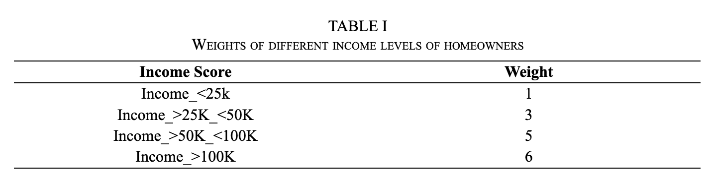
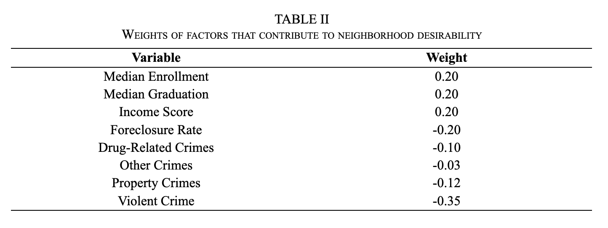
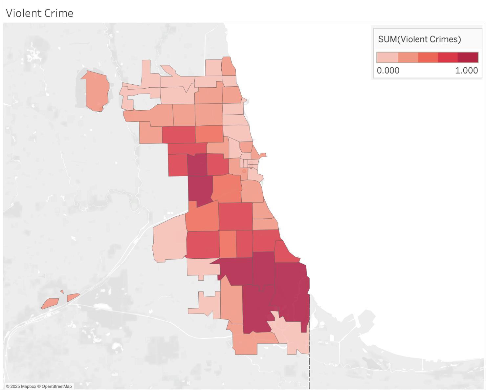
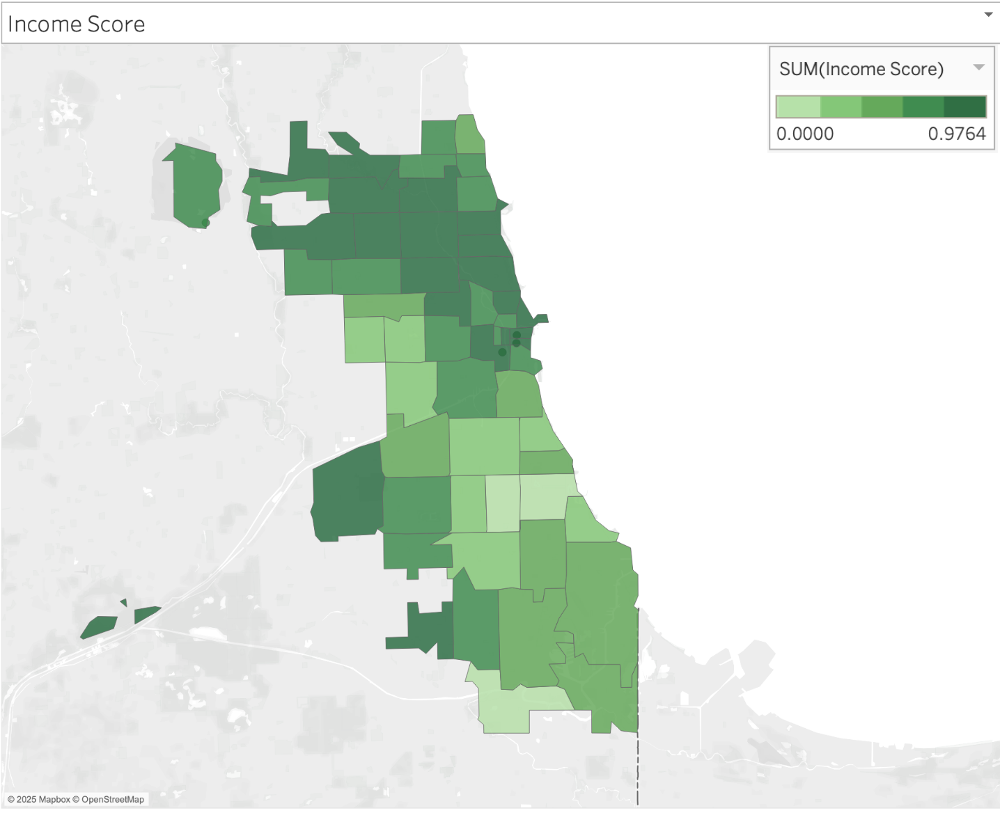
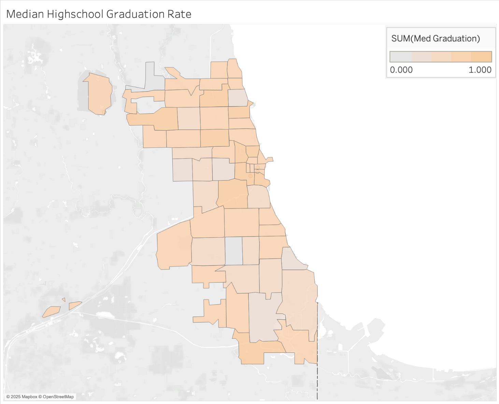
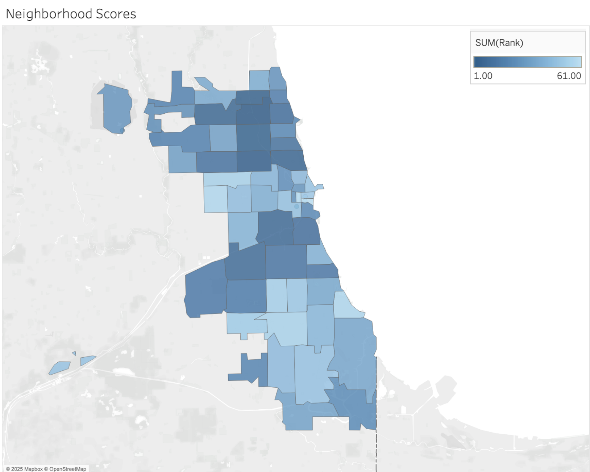

# Chicago Insights Dashboard - Python/Tableau

## Project Overview
Built on publicly available data, the Chicago Insights Dashboard proposed in this project intends to provide Chicago residents with insights into safety, schools, and housing value regarding their neighborhoods. Several previous projects have explored the creation of a community insights dashboard to provide average citizens with actionable insights. For example, in her thesis, Dowling develops a web-based GIS application to help residents of Anchorage, Alaska find neighborhoods that best fit their preferences based on crime rates, weather, real estate and other factors [1]. Sunkpho & Wipulanusat explored the potential value of using a Business Intelligence (BI) style dashboard, to present publicly available geospatial data [2]. While Ruiming Xu examined the effects that COVID-19 had on NYC neighborhoods [3]. These three dashboards are a few examples of previous projects utilizing publicly available data to deliver insights to average citizens. However, despite the large quantity of data available, the city of Chicago lacks a similar style dashboard.

The Chicago Community Insights Dashboard attempts to resolve this issue by creating a relational database that allows for deep, unrestricted analysis of the advantages and disadvantages of Chicago neighborhoods across multiple dimensions. The creation of the dashboard was initiated with the collection of multiple datasets covering housing, crime, and education in the Chicago metropolitan area. These datasets were transformed using Python into a consolidated table containing neighborhood scores, income scores, crime rates, and related metrics. This table was then utilized to design and develop an elegant, user-friendly dashboard using Tableau that empowers citizens to make informed decisions and learn about their neighborhoods. Included in the dashboard is a community score which is designed to evaluate neighborhood quality based on metrics from a combination of factors.

## Data Sources
- [Chicago Public Schools Dataset](https://data.cityofchicago.org/Education/Chicago-Public-Schools-School-Progress-Reports-SY2/2dn2-x66j/about_data)
- [Real Estate Data](https://www.housingstudies.org/data-portal/browse/?indicator=sales-100-residential-parcel&area=chicago-community-areas&property_type=0&view_as=view-table#)
- [Chicago Crime Data](https://data.cityofchicago.org/Public-Safety/Crimes-2001-to-Present/ijzp-q8t2/about_data)
- [Population & Income Data](https://www.housingstudies.org/data-portal/browse/?indicator=population-and-age&area=cook-county-municipalities&view_as=view-table)

## Methodology
This database introduces a metric known as the Community Score, designed to evaluate neighborhood quality across Chicago ZIP codes using a weighted scoring model. ZIP codes are ranked from most to least desirable based on a combination of factors grouped into three primary categories: housing, education, and crime. The Community Score provides a standardized measure to assist individuals in making informed decisions about where to live, while also offering policymakers and government officials a statistical decision-making tool to identify and address areas in need of localized improvements.

In assessing community scores across different ZIP codes, housing quality was measured based on two factors: income level of homeowners and foreclosure rate. Income levels were weighted to favor areas where homeowners had higher incomes as shown in Table I. For each ZIP code, these weighted income brackets were used to calculate an overall income score, which was then incorporated as a contributing variable in the Community Score model, as shown in Table II. According to research, increases in income improve housing quality, though the effect diminishes at higher levels [4]. This diminishing return occurs because, once a baseline standard of living is achieved, individuals are less inclined to allocate additional resources toward housing investments. Furthermore, a recent study found that nearly 20% of U.S. homeowners spend over 30% of their income on housing costs, suggesting that the correlation between income and housing quality begins to plateau beyond an income threshold of approximately $100,000. As a result, the weighting increment from the $50,000–$100,000 income bracket to the over $100,000 bracket is modest (an increase of 1), whereas increases between other income brackets are weighted more heavily (increments of 2) [5].

As previously stated, the model evaluates neighborhood quality using three primary categories: housing, education, and crime. Educational quality is measured through median enrollment and graduation rates, while housing is assessed based on an income score and the local foreclosure rate. Crime is further subdivided into four categories: violent crimes, property crimes, drug-related crimes, and other crimes. Table II shows the weights given in each category.  

A baseline weight of 0.20 was established for comparability across categories. To account for the greater impact it has on neighborhood desirability, crime was weighted to have 1.5 times the influence of either housing or education. Although the individual weights for housing and education include both positive and negative values, their combined absolute impact on the overall score is 0.4, while the crime category contributes a total weight of 0.6. Within the crime category, weights were distributed to prioritize severity: violent crime was assigned the highest impact, followed by property crime, drug-related crime, and other non-violent offenses. All variables were normalized prior to being incorporated into the weighted formula to account for differences in scale and range across the data. This ensured that variables with larger numerical ranges did not disproportionately influence the overall results.

Education variables—medium enrollment and graduation rates—are each given the baseline weight of 0.2 and are weighted positively, as they are strong indicators of long-term community health, social mobility, and lower future crime [6], [7]. Businesses are more likely to locate near areas with good schools because they are more likely to employ capable employees. Good schools also attract families, who contribute more significantly to the local economy than non-family households [8]. Income of homeowners is similarly weighted (0.2), based on the fact that people with higher incomes are going to buy better homes. This reflects the housing quality. Foreclosure rates carry a significant negative weight (-0.2), as they have been shown to reduce nearby property values and contribute to crime, social disorder, and population turnover [9]. The foreclosure rate was calculated by dividing the number of foreclosures in the area by the population.

Crimes were divided into four distinct categories: violent crimes, property crimes, drug crimes, and other crimes. This classification allowed for more severe crimes to affect the score more significantly than less severe crimes. Violent crimes, for example, typically have a greater impact on perceived neighborhood safety than property or drug-related crimes [10], [11]. In addition to crime data, the income distribution of homeowners was incorporated into the scoring model. 

Violent crime receives the greatest negative weight (-0.35) due to its substantial effects on both physical safety and mental health. Studies have shown violent crime in a neighborhood is closely linked to psychological distress in the residents even if those residents were not victims of the crime [10]. Hearing about violent crimes so close to where one lives, increases stress, puts people at risk for later mental health problems, and has significant impacts on how residents perceive their neighborhoods [11]. 

In regards to the non-violent crimes, property crimes (-0.12) are ranked as most important, drug-related crimes (-0.1) are second most important, and other non-violent crimes (-0.03) are least important. These crimes are ranked lower than violent crimes because they are not putting people in physical danger and they have less psychological impacts on residents. In regards to non-violent crimes, property crimes are ranked highest because it impacts resident’s sense of safety and financial security. Drug crimes are second because drug crimes are associated with mental illness, poverty, and can become the precursor to more impactful crimes [12]. Overall, the weights prioritize safety, education, income stability, and housing integrity as fundamental components of neighborhood quality.

## Results
The top 5 neighborhoods by quality score are:
  1. Lincoln Square (60625)
  2. Logan Square (60647)
  3. West Ridge (60659)
  4. Irving Park (60618)
  5. Depaul (60614)

## Visualizations

## Recommendations
The Chicago Community Insights Dashboard empowers residents, policymakers, and community leaders with clear insights into the safety, education, and housing conditions of Chicago neighborhoods. By consolidating housing, crime, and education datasets into a single relational database, we’ve created a Community Score to represent a standardized measure of neighborhood quality across ZIP codes. This score showcases both strengths and areas for improvement, offering value in several ways:

- For residents and families: Helps identify neighborhoods that align with their priorities—whether safety, schools, or housing stability.

- For policymakers and city officials: Provides an evidence-based tool to target resources where they are most needed and measure progress over time.

- For businesses and developers: Identifies promising areas for investment, driven by insights into long-term stability and community health.

## Sources
1. J. N. Dowling, “Finding Your Best-Fit Neighborhood: A Web GIS Application For Online Residential Property Searches for Anchorage, Alaska” Thesis, University of Southern California, 2014. Accessed: Apr. 05, 2025. [Online]. Available: https://spatial.usc.edu/wp-content/uploads/2014/10/DowlingJennifer.pdf

2. J. Sunkpho and W. Wipulanusat, “The Role of Data Visualization and Analytics of Highway Accidents,” Walailak Journal of Science and Technology (WJST), vol. 17, no. 12, pp. 1379–1389, Dec. 2020, doi: https://doi.org/10.48048/wjst.2020.10739.

3. R. Xu, “Comprehensive Data-Driven Analysis of NYC Real Estate Transactions | Manifold @CUNY,” Manifoldapp.org, Jan. 09, 2025. https://cuny.manifoldapp.org/projects/nyc-real-estate-transactions.

4. “Income Elasticity of Housing Demand | HUD USER,” Huduser.gov, 2021. https://www.huduser.gov/portal/publications/Income-Elasticity-of-Housing-Demand.html

5. Joint Center for Housing Studies of Harvard University, The State of the Nation’s Housing 2024. Cambridge, MA: Harvard University, 2024. [Online]. Available: https://www.jchs.harvard.edu/sites/default/files/reports/files/Harvard_JCHS_The_State_of_the_Nations_Housing_2024.pdf

6. F. T. Pfeffer and F. R. Hertel, “How Has Educational Expansion Shaped Social Mobility Trends in the United States?,” Social Forces, vol. 94, no. 1, pp. 143–180, Mar. 2015, doi: https://doi.org/10.1093/sf/sov045.

7. R. R. Swisher and C. R. Dennison, “Educational Pathways and Change in Crime Between Adolescence and Early Adulthood,” Journal of Research in Crime and Delinquency, vol. 53, no. 6, pp. 840–871, Aug. 2016, doi: https://doi.org/10.1177/0022427816645380.

8. M. Warner and R. Baran-Rees, The Economic Importance of Families with Children. Cornell University: Planning Across Generations, 2012

9. Z. L. Lin, E. Rosenblatt, and V. Yao. Spillover Effects of Foreclosures on Neighborhood Property Values. Journal of Real Estate Finance and Economics, Vol. 38, No. 4, May 2009 , Available at SSRN: https://ssrn.com/abstract=1033437

10. A. Curry, C. Latkin, and M. Davey-Rothwell, “Pathways to depression: The impact of neighborhood violent crime on inner-city residents in Baltimore, Maryland, USA,” Social Science & Medicine, vol. 67, no. 1, pp. 23–30, Jul. 2008, doi: https://doi.org/10.1016/j.socscimed.2008.03.007.

11. K. Hurst, “Parents’ worries about their children are often linked to how they assess the quality of their neighborhoods,” Pew Research Center, Mar. 13, 2023. https://www.pewresearch.org/short-reads/2023/03/13/parents-worries-about-their-children-are-often-linked-to-how-they-assess-the-quality-of-their-neighborhoods/

12. National Drug Intelligence Center, “Drug Abuse and Mental Illness Fast Facts,” www.justice.gov, Apr. 2004. https://www.justice.gov/archive/ndic/pubs7/7343/index.htm

